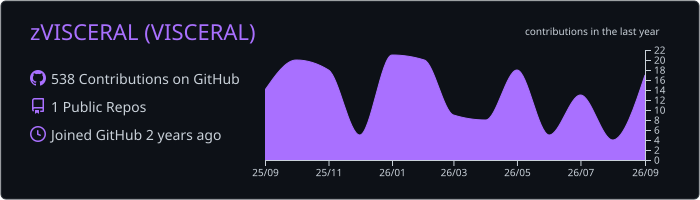
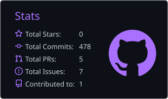
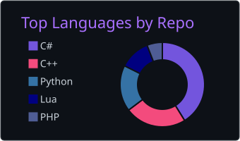

  

  
<strong>Reverse Engineering / Datamining / Custom Tooling</strong>

  

    
    
  

---

### About

I work on:

- **Game internals** — reverse engineering binaries, internal systems, and file formats.
- **API reverse engineering** — analyzing endpoints, request and response structures, and client–server communication.
- **Datamining tools** — building tools for asset extraction, data processing, and tracking changes between builds.
- **Private servers** — adapting game builds for compatibility with custom server implementations.

### Contact

For private repository access or collaboration inquiries:

  
  

### Stack

  

### GitHub Activity

<!-- Generated by .github/workflows/profile-stats.yml using SUMMARY_GITHUB_TOKEN. -->

  

  
  

---

  

